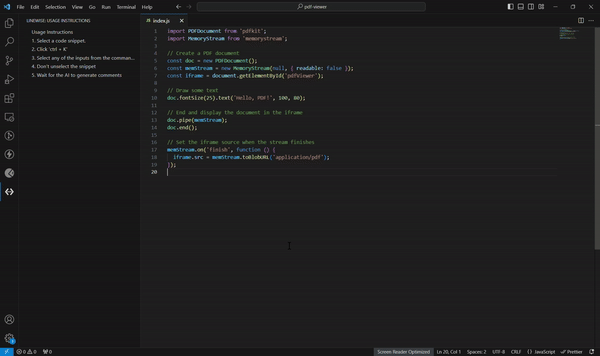

# Linewise - Visual Studio Code Extension

Transform your coding experience with Linewise – your intelligent assistant for seamless code documentation and vulnerability analysis. Say goodbye to tedious comment writing and security concerns. With Linewise, effortlessly generate descriptive comments for your code snippets and detect potential vulnerabilities in seconds. Empower your development workflow with AI-driven insights and streamline your coding process like never before.

## Features

- **Generate Comments**: Automatically generate comments for selected code snippets based on context and best practices.
- **View Vulnerabilities**: Quickly identify potential vulnerabilities within your code and take necessary actions to mitigate them.

## Supported Languages

Linewise supports generating comments for the following languages:
- JavaScript
- TypeScript
- Python
- Java
- C
- C++
- C#
- HTML/XML
- CSS
- PHP
- Ruby
- Swift

## Demo

## Installation

1. Open Visual Studio Code.
2. Go to the Extensions view by clicking on the square icon in the sidebar.
3. Search for "Linewise" in the Extensions view search box.
4. Click Install to install the extension.

## Usage

1. **Generating Comments**:
   - Select a code snippet.
   - Press `Ctrl + K` to open the command palette.
   - Choose "Generate Comments" to generate comments for the selected snippet.

2. **Viewing Vulnerabilities**:
   - Select a code snippet.
   - Press `Ctrl + K` to open the command palette.
   - Choose "View Vulnerabilities" to identify potential vulnerabilities within the selected snippet.

## Configuration

- You can customize certain aspects of the extension by modifying settings in the Visual Studio Code `settings.json` file.

## Contribution

Contributions are welcome! If you encounter any bugs or have suggestions for improvements, please feel free to open an issue or submit a pull request.

**Thank You!!**

## Contact

- If you have any questions reach out to:
  - [Vimalraj S] (vimalrajsvr404@gmail.com)
